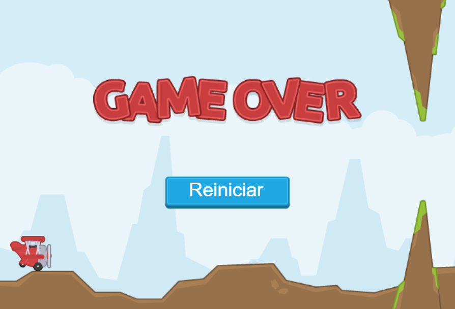

# FLAPPY PLANE COM CONSTRUCT
👨‍🏫É UM JOGO PARA CELULAR NO ESTILO "FLAPPY BIRD" ONDE O JOGADOR CONTROLA UM AVIÃO E PRECISA VOAR PELO CENÁRIO.

 <br> 

## DESCRIÇÃO:
**Flappy Plane** é um jogo para celular no estilo "Flappy Bird" onde o jogador controla um avião e precisa voar pelo cenário, desviando de canos e outros obstáculos. O jogo foi criado usando o software Construct 3.

## CARACTERISTICAS:
* **Controle simples:** O jogador controla o avião tocando na tela.
* **Desafio crescente:** A velocidade do jogo aumenta gradualmente, tornando-o mais difícil à medida que o jogador avança.
* **Obstáculos variados:** Há diversos tipos de obstáculos, como canos, tubos e espinhos, que exigem diferentes manobras para serem desviados.
* **Pontuação:** O jogador ganha pontos por cada obstáculo que consegue desviar.
* **Tela de Game Over:** O jogo termina quando o avião colide com um obstáculo.

## EXECUTANDO O PROJETO:
1. **Instalando as Depêndencias:**
   - Para instalar as dependências listadas no arquivo "package.json", você pode usar o comando `npm install`. Certifique-se de estar no diretório `./CODIGO`. O npm irá ler o arquivo "package.json" e instalar todas as dependências listadas nele. 

   ```bash
   npm install
   ```

2. **Executando o Jogo:**
   - Para subir o servidor, digite o seguinte comando no Terminal/CMD:
   ```bash
   npm start
   ```

   - Acesse o JOGO no navegador visitando [http://localhost:3000](http://localhost:3000).

## NÃO SABE?
- Entendemos que para manipular arquivos em `HTML`, `CSS` e outras linguagens relacionadas, é necessário possuir conhecimento nessas áreas. Para auxiliar nesse aprendizado, oferecemos alguns cursos:
* [CURSO DE HTML E CSS](https://github.com/VILHALVA/CURSO-DE-HTML-E-CSS)
* [CURSO DE JAVASCRIPT](https://github.com/VILHALVA/CURSO-DE-JAVASCRIPT)
* [CURSO DE NODEJS](https://github.com/VILHALVA/CURSO-DE-NODEJS)
* [CURSO DE EXPRESSJS](https://github.com/VILHALVA/CURSO-DE-EXPRESSJS)
* [CURSO DE CONSTRUCT](https://github.com/VILHALVA/CURSO-DE-CONSTRUCT)
* [CONFIRA MAIS CURSOS](https://github.com/VILHALVA?tab=repositories&q=+topic:CURSO)

## CREDITOS:
- [PROJETO CRIADO PELO "marcelopaludetto"](https://github.com/marcelopaludetto/construct-primeiro-jogo)
- [PROJETO EDITADO PELO VILHALVA](https://github.com/VILHALVA)
